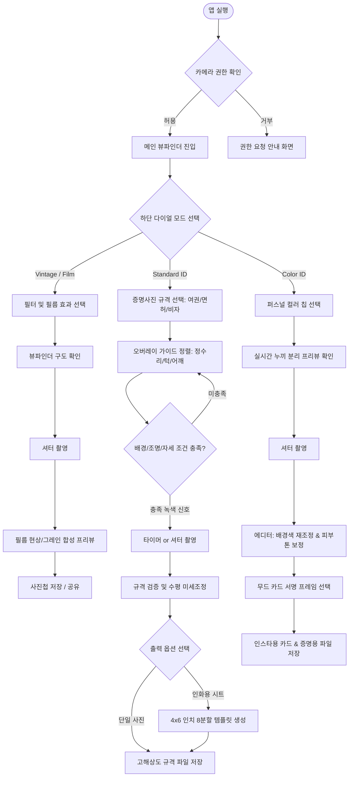

# [PRD] SnapStudio (올인원 아이폰 감성 & 프로필 카메라) 서비스 기획서

---

## 1. 프로젝트 개요 (Executive Summary)

### 1.1 서비스 컨셉
- **서비스명(가칭)**: **SnapStudio** (부제: All-in-Cam)
- **한 줄 정의**: 일상의 아날로그·Y2K 필름 감성부터 여권 규격 증명사진, 트렌디한 퍼스널 컬러 프로필까지 한 번에 완성하는 **올인원 iOS 네이티브 카메라 솔루션**
- **핵심 가치**: 
  - 기존에는 빈티지 사진 앱(Dazz Cam, NOMO Cam), 규격 증명사진 앱(포토펀치 등), 전문 스튜디오(시현하다 등)로 파편화되어 있던 경험을 **단일 앱 내 직관적인 3개 촬영 모드**로 통합.
  - 온디바이스 AI(Vision Framework)를 활용하여 스튜디오 수준의 조명 가이드, 배경 분리(누끼), 퍼스널 컬러 매칭을 모바일에서 완결.

### 1.2 개발 배경 및 문제 정의 (Problem & Opportunity)
1. **사진 앱 파편화**: 사용자들은 일상 감성 스냅용 앱과 증명사진/서류 제출용 사진 앱을 별도로 구매/설치해야 하는 피로감 존재.
2. **증명사진 스튜디오의 고비용·접근성 한계**: 급하게 여권 갱신, 자격증, 신분증, 이력서 사진이 필요할 때 스튜디오 예약 및 3~5만 원 이상의 비용 발생.
3. **MZ세대의 '컬러 증명사진' 대중화**: 단순 흰색 배경 증명사진을 넘어 자신만의 개성을 표현하는 퍼스널 컬러 배경 프로필 수요 급증. 집에서 간편하게 고화질 아이폰 카메라로 완성도 높은 결과물을 얻고자 하는 니즈 충족.

### 1.3 타겟 오디언스 (Target Audience) & 페르소나
- **Primary Target (2030 세대 / SNS 액티브 유저)**:
  - 인스타그램, 스레드에 Y2K·필름 감성 사진을 자주 업로드하며, 프로필 사진으로 감각적인 컬러 배경 포토를 선호하는 사용자.
- **Secondary Target (취준생, 직장인, 해외 여행자)**:
  - 여권 재발급, 운전면허증 갱신, 사원증 제출, 서류 전형용 이력서 사진을 스튜디오 방문 없이 집에서 규격에 맞게 깔끔하게 해결하고 싶은 사용자.

---

## 2. 핵심 촬영 모드 3종 상세 정의 (Core Shooting Modes)

SnapStudio는 메인 뷰파인더 하단의 **'다이얼 모드 스위처'**를 통해 아래 3가지 모드를 매끄럽게 전환합니다.

```
       [ Vintage / Film ]  ◀───▶  [ Standard ID ]  ◀───▶  [ Color ID ]
```

---

### [Mode 1] Vintage / Multi-Cam (11종 명기 카메라 & 필름 라인업)
소니·캐논·캠코더·인스탁스 등 레트로 명기 카메라의 광학적 색감과 LCD OSD 타임코드를 완벽 재현한 모드.

| 카테고리 | 대표 기종 및 필터 | 특징 및 전용 OSD / 프레임 연출 |
| :--- | :--- | :--- |
| **캠코더 & 테이프** | • **Sony DCR Handycam**<br>• **Hi8 / VHS Tape**<br>• **Super 8mm Cine** | • 소니 미니DV 핸디캠 푸른 틴트 + 녹화 `REC`, `SP 0:00:14`, 배터리 OSD<br>• JVC/Hi8 비디오 테이프 수평 스캔라인 글리치 + `PLAY ▶`<br>• 70년대 홈무비 시네 필름 비네팅 및 세피아 웜톤 |
| **디지털 CCD (Y2K)** | • **Canon IXY Digital**<br>• **Sony Cyber-shot**<br>• **Olympus Camedia** | • 캐논 특유의 화사하고 따뜻한 살구빛 웜톤 스킨톤 + 오렌지 디지털 데이트 각인<br>• 2000년대 명기 소니 사이버샷 CCD 쿨톤 + `5.1 MEGAPIXELS` OSD<br>• 로우파이 그린-옐로우 틴트의 빈티지 디카 플래시 감성 |
| **즉석 인화 (Instant)** | • **Fuji Instax Mini**<br>• **Polaroid 600** | • 인스탁스 미니 고유의 하단 여백이 넓은 화이트 카드 프레임 + `instax mini` 로고 각인<br>• 클래식 정방형 빈티지 폴라로이드 600 프레임 + 페이드된 블랙 |
| **35mm 클래식 필름** | • **Kodak Gold 200**<br>• **Fujifilm Superia 400**<br>• **Kodak Tri-X Noir** | • 골든 아워 앰버 웜톤과 풍부한 옐로우/레드 계조<br>• 청량한 에메랄드/그린 섀도우와 맑은 일본 빈티지 스냅 감성<br>• 묵직하고 거친 콘트라스트의 스트리트 흑백 아날로그 입자감 |

---

### [Mode 2] Standard ID (표준 규격 증명사진 모드)
공공기관 및 기업 제출 규격을 100% 충족할 수 있도록 정밀 가이드와 검증 시스템을 제공하는 실용 모드.

| 구분 | 상세 기능 요구사항 |
| :--- | :--- |
| **지원 규격 프리셋** | • **대한민국 여권**: 3.5cm x 4.5cm (정수리부터 턱까지 머리 길이 3.2cm ~ 3.6cm 규정 엄수)<br>• **주민등록증 / 운전면허증**: 3.5cm x 4.5cm (최근 6개월 이내 촬영 규격)<br>• **취업 이력서 / 학생증**: 3cm x 4cm (반명함판)<br>• **글로벌 비자 (미국/중국 등)**: 2 x 2 inch (5cm x 5cm) 또는 국가별 지정 비율 |
| **정밀 가이드 오버레이** | • **실시간 스마트 안면 가이드**: Vision Framework를 통한 안면 랜드마크 실시간 추적<br>• **3대 필수 가이드라인**: 정수리선(Top), 턱끝선(Chin), 양 어깨 수평선(Shoulder)<br>• **거리 인디케이터**: 카메라와 얼굴 간 거리가 너무 가깝거나 멀 때 가이드 색상 변경 (초록: 적정, 빨강: 조정 필요) |
| **배경 및 조명 감지** | • **단색 배경 검증 가이드**: 여권 규격용 완전 무늬 없는 흰색/연회색 배경 충족 여부 실시간 판단<br>• **얼굴 그림자 경고**: 얼굴 좌우 조명 불균형 또는 턱밑 과도한 그림자 감지 시 안내 팝업 |
| **인쇄용 템플릿 출력** | • 사진관 인화 규격인 **4x6인치(10x15cm)** 인화지에 6매 또는 8매 자동 배치 그리드 템플릿 생성<br>• 자르기 가이드 재단선(Crop Marks) 자동 렌더링 및 고해상도 PDF/JPG 저장 |

---

### [Mode 3] Color ID (시현하다 스타일 퍼스널 컬러 스튜디오 모드)
'시현하다' 등 프리미엄 컬러 증명 스튜디오 감성을 모바일에서 완벽 구현하는 나만의 컬러 프로필 모드.

| 구분 | 상세 기능 요구사항 |
| :--- | :--- |
| **시현하다 시그니처 & 퍼스널 팔레트** | • **시현하다 Best 8색**: Blossom Pink(#F38B95), Sage Olive(#80926C), Soft Sky(#89B6D7), Oat Beige(#DFCBB5), Crimson Wine(#781F2F), Pop Fuchsia(#E93B81), Camel Ochre(#C89A58), Muted Lavender(#9B8CB4)<br>• **스튜디오 센터 조명 렌더링**: 중심부가 화사하게 밝아지는 방사형 소프트 라이트(Radial Highlight) 백드롭 천 느낌 재현<br>• **4계절 16색 + 그라디언트 4종 + 커스텀 HEX 피커(🎨+)** 지원 |
| **실시간 인물 누끼 & 배경 치환** | • Apple Vision / CoreML의 **Portrait Matte Generation**을 활용한 초정밀 온디바이스 인물 분리<br>• 뷰파인더에서 실사 투명 모델(여성/남성/내 사진 업로드) 뒤로 선택한 배경이 100% 매끄럽게 실시간 치환<br>• 피부 톤업 및 내추럴 스무딩 슬라이더 (0~100%) |
| **시현하다 모먼트 카드 프레임** | • **상단 레터링**: `[이름]'s Moment` (사용자가 직접 탭하여 이름 커스텀 편집 가능) + `Young Adults - Best Record • Photos by SnapStudio`<br>• **하단 시그니처 각인**: 촬영일자 및 아카이브 넘버(`2026.10.05 RECORD`), 컬러 코드 배지, 감성 필기체 작가 친필 서명(`Sihyun Sign`)<br>• 셔터 촬영 시 해당 프레임과 각인이 온디바이스 캔버스에 영구 합성 저장 |

---

## 3. 정보 구조도 (IA: Information Architecture) & 사용자 여정

### 3.1 Information Architecture (IA)

```
SnapStudio
│
├── [1.0] Camera Main (카메라 메인 뷰파인더)
│   ├── [1.1] Top Toolbar (상단 유틸리티)
│   │   ├── 플래시 토글 (Off / On / Auto / Torch)
│   │   ├── 타이머 설정 (Off / 3s / 10s)
│   │   ├── 화면 비율 (1:1 / 4:3 / 16:9 / ID 규격)
│   │   ├── 전/후면 카메라 전환
│   │   └── 가이드라인 토글 (격자 / ID 규격선 / 수평계)
│   ├── [1.2] Viewfinder Canvas (중앙 뷰 영역)
│   │   ├── 실시간 프리뷰 (필터 / 누끼 배경 실시간 적용)
│   │   ├── 안면 트래킹 & 규격 가이드라인 오버레이
│   │   └── 수평/수직 자이로 인디케이터
│   ├── [1.3] Control Drawer (중앙 하단 컨텍스트 드로어)
│   │   ├── [Mode 1 전용] 필터 캐러셀 & 필름 효과 슬라이더 (Grain, Date)
│   │   ├── [Mode 2 전용] 증명 규격 셀렉터 (여권 / 면허증 / 비자) & 조명 체크
│   │   └── [Mode 3 전용] 퍼스널 컬러 팔레트 & 톤 보정 강도
│   └── [1.4] Bottom Action Bar (하단 메인 액션)
│       ├── 최근 촬영 썸네일 (Gallery 진입)
│       ├── 셔터 버튼 (Haptic Feedback)
│       └── 다이얼 모드 스위처 (Vintage ◀▶ Standard ID ◀▶ Color ID)
│
├── [2.0] Editor & Preview (촬영 직후 확인 및 보정)
│   ├── [2.1] 비교 뷰 (원본 vs 보정본 토글)
│   ├── [2.2] 배경 컬러 즉시 변경 툴 (Color ID 모드)
│   ├── [2.3] 피부 톤 / 세부 리터치 슬라이더 (0 ~ 100%)
│   ├── [2.4] 프레임 및 각인 설정 (날짜 스탬프, 스튜디오 시그니처)
│   └── [2.5] 규격 재단 및 정렬 보정 (Standard ID 모드)
│
└── [3.0] Export & Print (내보내기 및 인쇄)
    ├── [3.1] 단일 고해상도 저장 (JPEG / HEIC / PNG 투명배경)
    ├── [3.2] 4x6 인화용 다건 배치 시트 생성 (6컷/8컷 PDF 및 인화 사진 파일)
    ├── [3.3] 시스템 공유 시트 (AirDrop, 인스타그램, 메시지)
    └── [3.4] AirPrint 직접 인쇄 지원
```

---

### 3.2 핵심 사용자 여정 (User Flow)



---

## 4. 화면별 상세 기능 요구사항 (Functional Specifications)

### 4.1 [SCR-01] 메인 카메라 뷰파인더 (Main Camera View)
- **화면 목적**: 왜곡 없는 프리뷰 제공 및 직관적인 원터치 촬영 환경 구축.
- **주요 UI 요소 및 인터랙션**:
  1. **상단 툴바**:
     - 플래시: `Auto` -> `On` -> `Off` -> `Torch` 순환.
     - 타이머: 3초, 10초 카운트다운(화면 중앙 대형 숫자 표시 및 플래시 점멸 피드백).
     - 가이드라인 토글: 3x3 삼분할선, 수평계 자이로 레벨러.
     - 렌즈 전환: 전면 Ultra-Wide/Wide 토글, 후면 1x, 2x, 3x 광학 줌 탭.
  2. **중앙 뷰파인더**:
     - 탭 포커스(Tap-to-Focus) 및 노출 조절 슬라이더(노란색 태양 아이콘 상하 드래그).
     - 모드별 가이드라인이 카메라 위에 넌블로킹(Non-blocking) 레이어로 렌더링.
  3. **하단 모드 스위처 (Mode Roller Wheel)**:
     - 스와이프 또는 텍스트 탭으로 부드럽게 스냅핑되는 휠 인터페이스.
     - 모드 변경 시 햅틱(Selection Feedback) 제공.
  4. **셔터 버튼**:
     - 탭: 일반 촬영.
     - 길게 누르기(Long Press): 연사(Burst) 또는 숏폼 비디오(추후 확장).

### 4.2 [SCR-02] 빈티지 필터 드로어 (Vintage Drawer)
- **필터 썸네일 스트립**: 가로 스크롤 캐러셀 형태로 실시간 룩앤필 확인.
- **효과 퀵 슬라이더**:
  - Grain Slider: 0% ~ 100% (기본값 40%).
  - Light Leak Switch: Off / Low / High / Random.
  - Date Stamp Style: Classic Orange / Red / Digital LCD Gray / Off.

### 4.3 [SCR-03] 규격 증명 가이드라인 오버레이 (Standard ID Guide HUD)
- **안면 트래킹 락(Face Lock Indicator)**:
  - Vision Framework의 `VNDetectFaceLandmarksRequest`를 활용하여 사용자 눈, 코, 턱선을 실시간 감지.
  - 정수리선(상단 타원 가이드), 턱끝선(하단 곡선), 어깨선(좌우 가로 가이드) 렌더링.
  - 얼굴 크기가 규격 범위(여권 기준 전체 높이의 70~80%) 내에 들어오면 가이드선이 **반투명 흰색 -> 밝은 민트색(#00E5A3)**으로 전환.
- **자세 및 조명 실시간 코칭 텍스트**:
  - *"고개를 오른쪽으로 살짝 돌려주세요."*
  - *"얼굴에 그림자가 져 있습니다. 밝은 곳을 바라봐주세요."*
  - *"휴대폰을 눈높이로 들어 올려주세요 (수평 유지 요망)."*

### 4.4 [SCR-04] 컬러 증명사진 팔레트 드로어 (Color ID Drawer)
- **컬러 칩 셀렉터**:
  - 4개 탭(봄웜 / 여름쿨 / 가을웜 / 겨울쿨 / 커스텀).
  - 24종 이상의 원형 컬러 칩 제공. 컬러 칩 선택 시 0.1초 내 뷰파인더 배경 즉시 합성.
- **실시간 누끼 블렌딩 엔진**:
  - `VNGeneratePersonSegmentationRequest` (Quality Level: Balanced/Accurate) 적용.
  - 경계면 Feathering(부드러운 가장자리 처리)을 통해 잔머리 어색함 최소화.
- **스킨 스무딩 레벨**: 3단계 (Natural 30% / Clear 60% / Studio Glow 90%).

### 4.5 [SCR-05] 에디터 및 내보내기 시트 (Preview & Export Sheet)
- **배경 교체 탭**: 촬영 후에도 누끼 데이터가 보존되어 언제든 24종 배경색을 자유롭게 재선택 가능.
- **인화용 템플릿 생성기**:
  - 버튼 클릭 한 번으로 `4x6인치 8분할 여권사진 배치` 캔버스 자동 렌더링.
  - 재단용 십자선(Crop Mark) 및 흰색 테두리 여백 자동 삽입.
- **원클릭 공유 & 저장**:
  - [사진첩에 저장 (고해상도)]
  - [4x6 인화 시트 저장 (PDF/JPG)]
  - [인스타그램 공유 (정방형 컬러 무드 카드)]

---

## 5. iOS 전용 특화 UX 및 기술 고려사항 (Native Tech Stack)

SnapStudio는 크로스 플랫폼이 아닌 **100% iOS Native (SwiftUI + AVFoundation)**로 개발되어 하드웨어 최적화와 애플 생태계 감성을 극대화합니다.

```
┌─────────────────────────────────────────────────────────────┐
│                       SwiftUI (UI Layer)                    │
│    - Mode Switcher Wheel     - HUD Guideline Overlay        │
│    - Color Picker Sheet      - Live Filter Carousel         │
├──────────────────────────────┬──────────────────────────────┤
│      Core Image / Metal      │    Vision / CoreML Engine    │
│  - Realtime LUT Color Filters│  - Face Landmark Detection   │
│  - Film Grain / Halation / Leak│  - Person Segmentation Matte │
├──────────────────────────────┴──────────────────────────────┤
│               AVFoundation (Camera Pipeline)                │
│    - AVCaptureSession (4K Photo Output)                     │
│    - AVCapturePhotoOutput (DepthData / PortraitEffectsMatte)│
└─────────────────────────────────────────────────────────────┘
```

### 5.1 하드웨어 및 iOS 네이티브 연동
1. **CoreHaptics 기반 정밀 햅틱 피드백**:
   - 모드 다이얼 휠 스크롤: 휠을 넘길 때마다 미세한 `UISelectionFeedbackGenerator` 동작.
   - 규격 가이드라인 정렬 완벽 일치 시: `UINotificationFeedbackGenerator(.success)`의 경쾌한 2타 햅틱.
   - 셔터 동작: 기계식 카메라 특유의 묵직한 셔터 충격파 모사.
2. **물리 하드웨어 키 제어**:
   - **볼륨 상/하 버튼**: 물리 셔터로 동작 (증명사진 촬영 시 삼각대 거치 후 블루투스 리모컨 또는 볼륨키 활용 극대화).
   - **iPhone 15 Pro / 16 시리즈 Action Button 연동**: 앱 즉시 실행 및 특정 모드 다이렉트 진입 단축어 지원.
3. **카메라 파이프라인 (AVFoundation)**:
   - 전면 TrueDepth 카메라 지원: 인물 사진 모드(Depth Data)를 활용하여 정교한 헤어라인 누끼 추출.
   - P3 Wide Color Gamut 지원: 퍼스널 컬러의 깊은 색감과 피부 톤을 손실 없이 렌더링.
   - 초고해상도 사진 캡처: 규격 증명사진 인화 시 300DPI 이상을 보장하는 고해상도 버퍼 추출.
4. **프라이버시 & 온디바이스 AI (100% On-Device Processing)**:
   - 모든 얼굴 인식, 배경 분리(누끼), 사진 보정은 외부 서버 전송 없이 사용자의 아이폰 내부(A-시리즈/Apple Silicon Neural Engine)에서 로컬 처리.
   - 개인정보(신분증/여권용 사진) 유출 우려를 원천 차단하여 사용자 신뢰도 극대화.

---

## 6. 제품 로드맵 및 단계별 출시 전략 (Milestones)

### Phase 1: MVP (Launch - v1.0)
- **목표**: 3대 핵심 모드의 기본 플로우 및 카메라 촬영 파이프라인 완성.
- **범위**:
  - AVFoundation 기반 커스텀 카메라 UI 및 모드 스위처.
  - [Vintage] 클래식 필터 4종 + 필름 그레인 + 날짜 스탬프.
  - [Standard ID] 여권(3.5x4.5cm) 규격 오버레이 + 4x6 인화 8분할 템플릿 내보내기.
  - [Color ID] 12개 기본 퍼스널 컬러 칩 + 실시간 Vision Person Segmentation 배경 합성.
  - 볼륨키 셔터 및 햅틱 피드백 적용.

### Phase 2: Feature Expansion (v1.5)
- **목표**: 상용 스튜디오급 보정 품질 및 확장 규격 지원.
- **범위**:
  - [Standard ID] 미국/중국 비자, 운전면허증 등 다국적 규격 추가 및 조명/그림자 AI 자동 보정.
  - [Color ID] 24종 4계절 팔레트 완성, 커스텀 HEX 피커, 스튜디오 무드 서명 카드 프레임.
  - 잡티 제거 및 자연스러운 스킨 리터치 브러시 에디터.
  - 사진 인화 서비스(Snaps, 찍스 등) 및 공공기관 온라인 사진 규격 자동 리사이징(용량 500KB 이하 제한 등) 내보내기 프리셋.

### Phase 3: Pro Ecosystem (v2.0)
- **목표**: 구독 모델 및 프로 기능 고도화.
- **범위**:
  - Apple Watch 원격 뷰파인더 & 셔터 제어 (삼각대 혼자 촬영 완벽 지원).
  - ProRAW 캡처 및 데스크톱급 HSL 컬러 그레이딩.
  - 프리미엄 빈티지 필름 팩 및 인플루언서 콜라보 컬러 팔레트 인앱 결제(IAP).

---

## 7. 성공 지표 (KPI)

1. **촬영 완료율 (Shooting Completion Rate)**: 뷰파인더 진입 후 셔터를 누르고 사진을 저장/내보내기하는 비율 (목표: 75% 이상).
2. **모드별 사용 비중**: Vintage Mode(일상 공유용)와 ID Modes(실용/프로필용) 간의 리텐션 시너지 분석.
3. **증명사진 규격 반려율 (Rejection Rate)**: 외교부/정부24 온라인 여권 사진 검증 통과율 98% 이상 달성.
4. **소셜 바이럴 지수**: Color ID 모드의 무드 카드 템플릿 인스타그램 공유 수.
